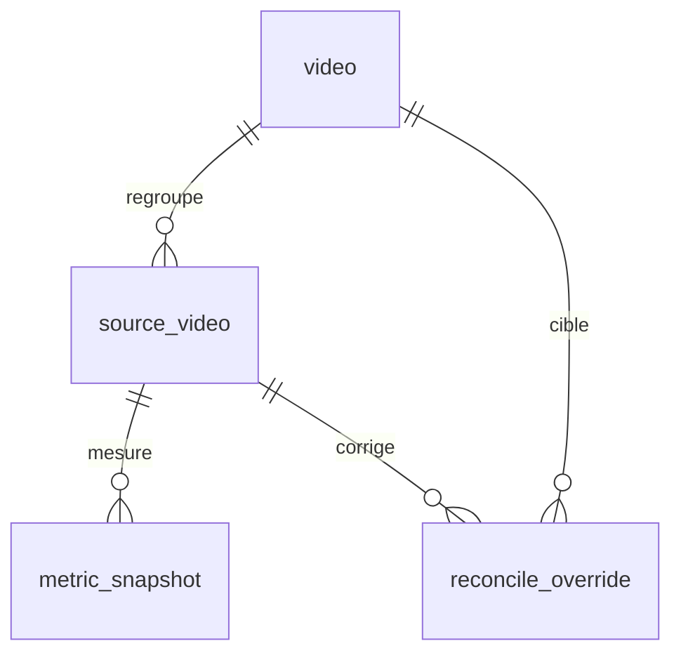

# Base de données UGO2

UGO2 utilise MariaDB. Toutes les dates métier sont stockées en UTC et chaque instance utilise une base distincte.

## Modèle métier

| Table | Clé ou contrainte | Rôle |
|---|---|---|
| `video` | `id`, `slug` unique | Vidéo canonique. |
| `source_video` | `(platform, platform_video_id)` unique | Publication d’une plateforme, éventuellement rattachée à une vidéo. |
| `metric_snapshot` | `(source_video_id, snapshot_at)` unique | Métriques cumulées et engagement à un instant. |
| `reconcile_override` | FK source et cible facultative | Actions `LINK`/`UNLINK` en attente. |

## Exploitation

| Table | Rôle |
|---|---|
| `platform_health` | Dernier succès/échec, snapshot, durée, volume et état du token par plateforme. |
| `batch_run` | État minimal des exécutions du batch. |
| `refresh_job_state` | État sale/propre, durée, dernier succès et erreur assainie du refresh. |

## Lectures analytiques réellement utilisées

| Objet | Consommateur |
|---|---|
| `v_metric_snapshot_enriched` | Détail, tendances et séries intégrées au détail. |
| `v_source_latest_snapshot` / `v_source_latest_enriched` | Dernier état de chaque source. |
| `v_video_last_snapshot` | Date de dernière mesure dans la liste. |
| `mv_video_rollup` | Liste, totaux, filtres et tris. |
| `mv_video_views_aligned_hour_raw` | Points horaires alignés sur la publication. |
| `mv_video_views_aligned_dense` | Série densifiée utilisée pour les comparaisons. |
| `mv_video_views_percentiles` | Bandes de percentiles des graphes. |
| `mv_refresh_control` | Horodatage historique du refresh du rollup. |

`MaterializedViewsSql.php` crée et remplit les trois tables `mv_video_views_*`. `MaterializedRefreshService` et `HealthStateService` assurent encore du `CREATE TABLE IF NOT EXISTS` au démarrage ; ce DDL à la volée est suivi dans `TODO.md`.

## Intégrité applicative

- `null` signifie « inconnu » et ne remplace pas une valeur connue.
- `views_native` et `total_watch_seconds` sont corrigés s’ils régressent.
- Un snapshot n’est stocké que pour un premier point, une mise à jour au même instant, un delta significatif, un changement utile ou le garde-fou quotidien.
- Le refresh est marqué sale à l’ingestion et exécuté sous verrou MariaDB.

## Scripts SQL

| Scripts | Contenu |
|---|---|
| `001`–`004` | Tables métier, vues initiales, index et overrides. |
| `005`–`007` | Fallback `reach`, rollup et premières structures de graphes. |
| `008` | Santé, exécutions batch et état du refresh. |

Ces fichiers sont un bootstrap historique, pas une chaîne de migrations. `001` et `004` suppriment des tables ; d’autres scripts recréent des vues ou des tables non idempotentes. Ils sont réservés à une base vide et ne doivent pas être appliqués automatiquement à une base contenant des données.

Une vue relationnelle maintenue se trouve dans [`db.puml`](db.puml). Les anciens PNG non générés automatiquement ne font pas foi.
